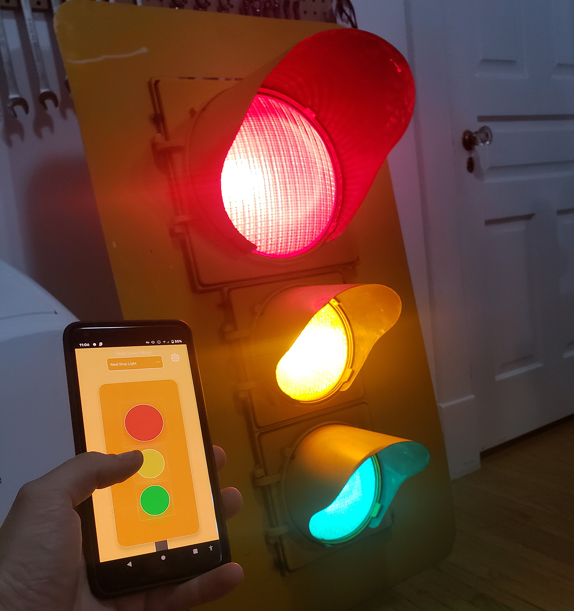
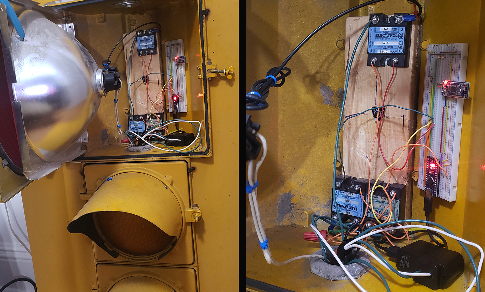
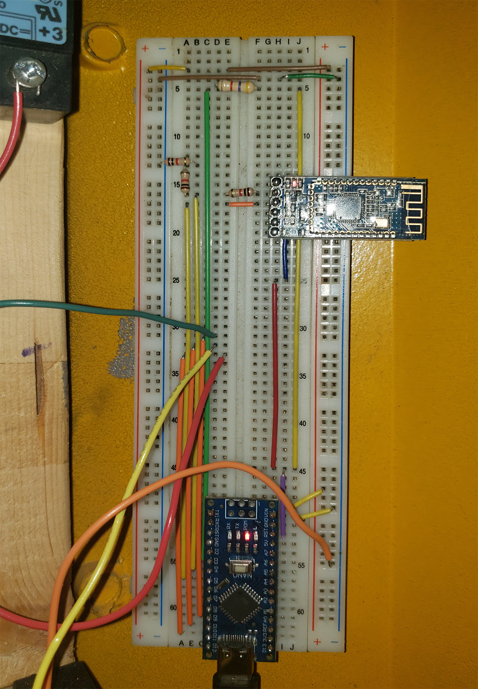

# Arduino StopLight Project

Years ago my grandpa acquired a full sized municipal traffic light from a scrap yard picker. Hey brought it home for my dad and I, and it became my first significant Arduino project. It consisted of some relays and an Uno board, running a set loop of instructions. I remember standing out on the sidewalk infront of the house timing how long the stoplights took to change, and then setting those delays in my little Arduino sketch.

Recently the stop light was passed down to me, and so I brought it home and started on a full redesign.

I had quite a few ideas for it, including a sonar based proximity sensor to be hung in a garage, that way you know when you're parked far enough in. As I don't actually have a garage, I opted for a BLE controller instead. I wanted a nice frontend as well, so I paired it with a React Native app that can be found [in this repository here](https://github.com/DavidASix/StopLight_App).

The circuit is relatively simple. As older stoplights use regular 120 volt light bulbs, I simply wired up three solid state relays into the lamps and my Arduino Nano's outputs. I then connected an HM-10 module aptly named "Real Stop Light" and the base was laid.
I realized quickly that the lights get *quite* hot, so I included a DS18B20 temperature sensor as well. Then I wired in a standard AC plug, linked directly to the relays and to a USB block for the Arduino.

